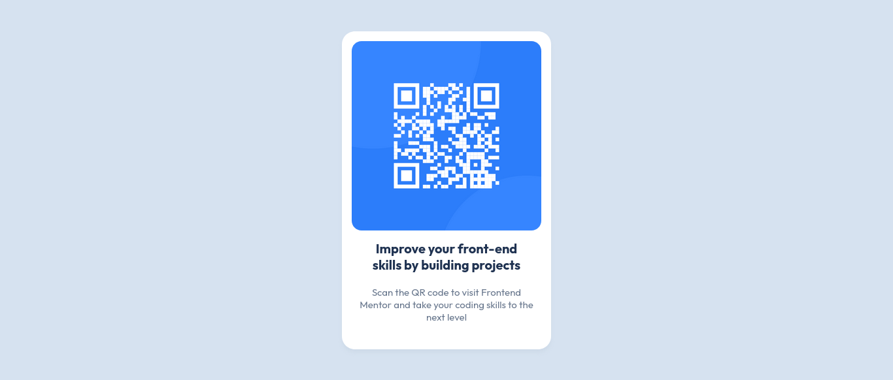

# 🌟 QR Code Component - Frontend Mentor Solution 🚀

Welcome to my solution for the **QR Code Component Challenge** on [Frontend Mentor](https://www.frontendmentor.io/challenges/qr-code-component-iux_sIO_H)! This project is designed to help you improve your front-end skills by building realistic and responsive components. Let’s dive in! 💻✨

---

## 📋 Table of Contents

- [Overview](#overview)
  - [The Challenge](#the-challenge)
  - [Screenshot](#screenshot)
  - [Links](#links)
- [My Process](#my-process)
  - [Built With](#built-with)
  - [What I Learned](#what-i-learned)
  - [Continued Development](#continued-development)
- [Author](#author)

---

## 🌟 Overview

### 🎯 The Challenge

The goal of this challenge was to build a **QR code component** that is:
- **Responsive**: Works seamlessly on all screen sizes, from mobile to desktop. 📱💻

### 📸 Screenshot

Here’s a preview of the final result:



### 🔗 Links

- **Live Site URL**: [View Live Demo](https://alaa-mekibes.github.io/qr-code-component-frontend-mentor)
- **Solution URL**: [Frontend Mentor Solution](https://www.frontendmentor.io/solutions/qr-code-component-Lma2ugvVpU)

---

## 🛠️ My Process

### 🧰 Built With

- **Semantic HTML5 Markup** 📄
- **CSS Custom Properties** 🎨
- **Flexbox** 📏
- **Mobile-First Workflow** 📱
- **REM Units** 📐

### 🧠 What I Learned

Through this project, I reinforced my understanding of:
- **Semantic HTML Elements**: I learned how to use semantic tags like `<section>`, `<article>`, and `<main>` to structure my content meaningfully. This improves accessibility and SEO while making the code easier to read and maintain.

```html
  <main class="qr-container">
    <section class="qr-code">
      <article class="qr-content">
        
        <h1>Improve your front-end skills by building projects</h1>
        <p>Scan the QR code to visit Frontend Mentor and take your coding skills to the next level!</p>
      </article>
    </section>
  </main>
```

- REM Units: I used rem units for sizing and spacing to ensure a consistent and scalable design. Unlike pixels, rem units are relative to the root font size, making it easier to create responsive layouts.

```css

:root {
  font-size: 16px; /* Base font size */
}

.qr-content h1 {
  font-size: 1.5rem; /* 24px */
  margin-bottom: 1rem; /* 16px */
}

.qr-content p {
  font-size: 1rem; /* 16px */
  margin-bottom: 1.5rem; /* 24px */
}
```

- Responsive Design: I ensured the component looks great on all devices by using a mobile-first approach and media queries.

### 🚀 Continued Development

In future projects, I’d like to focus on:

- CSS Grid: Exploring more advanced layout techniques.

- Accessibility: Ensuring my components are fully accessible to all users.

- Animations: Adding more dynamic and engaging animations.

## ✍️ Author

- Frontend Mentor Profile: [@alaa-mekibes](https://www.frontendmentor.io/profile/alaa-mekibes)

Feel free to explore the project and provide feedback! Let’s keep coding and building amazing things together! 💪✨
